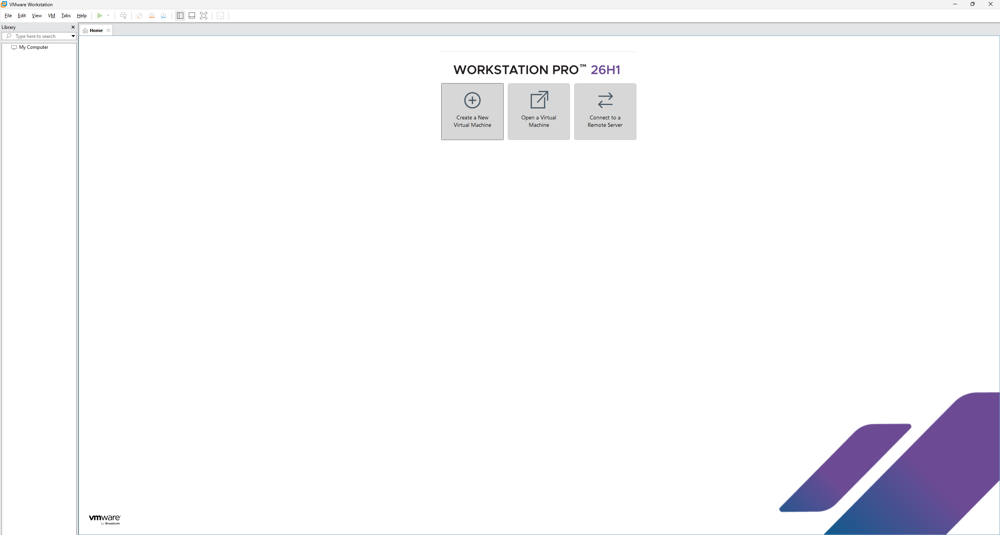
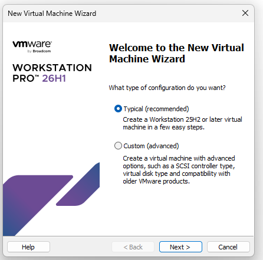
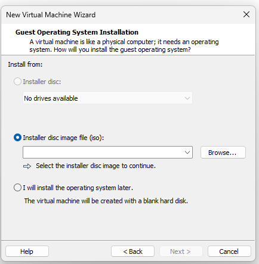
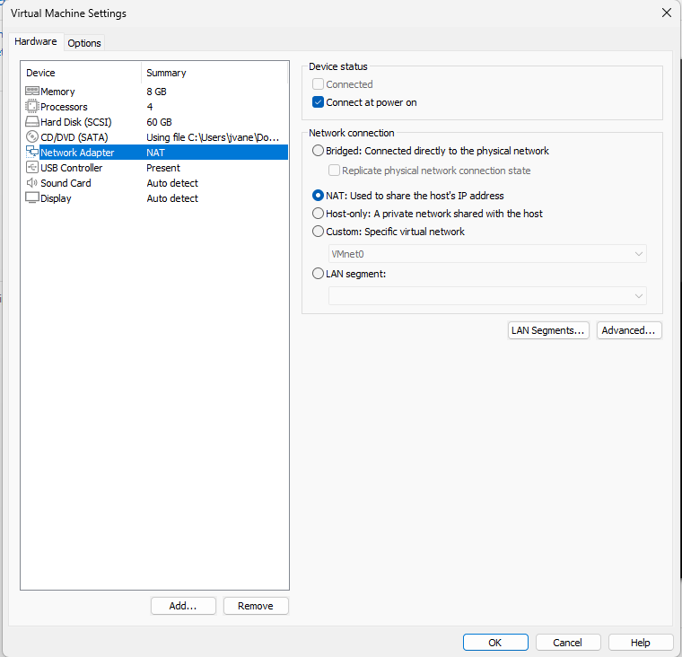
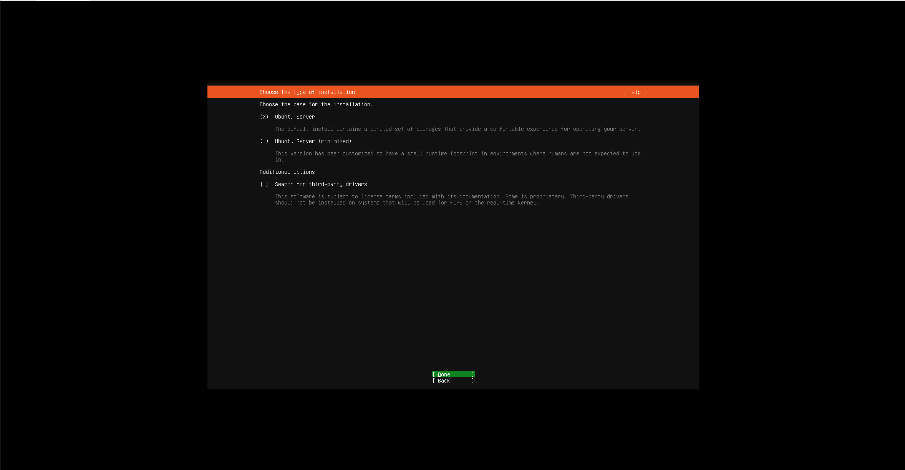
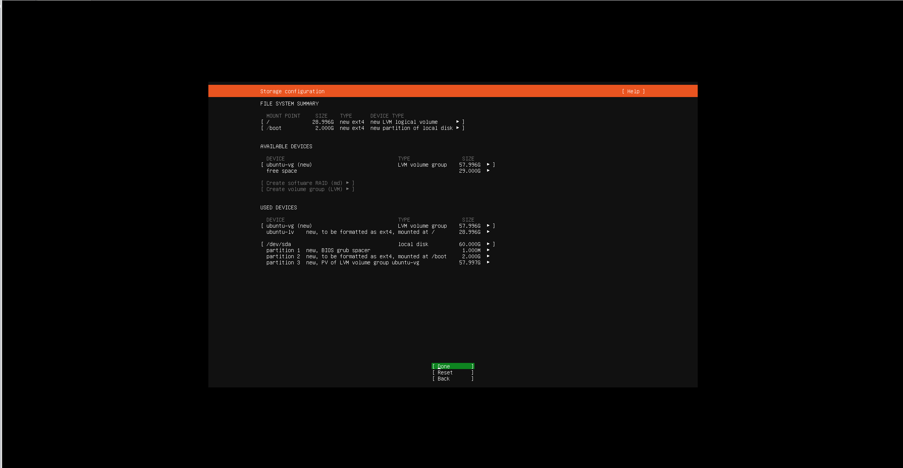
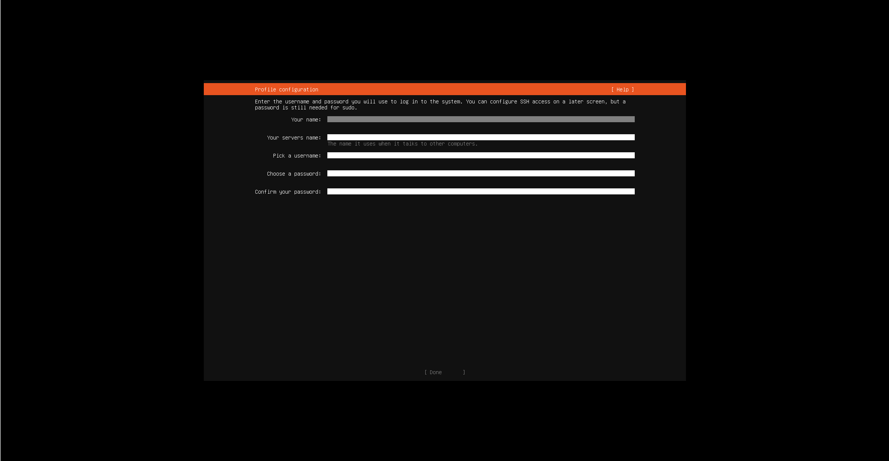
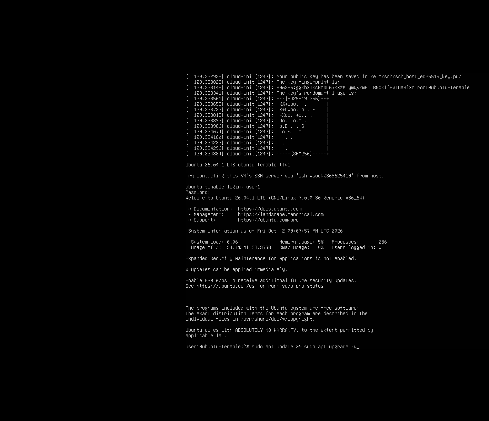
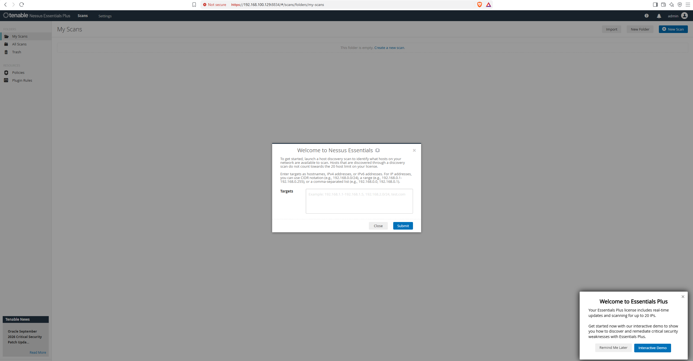
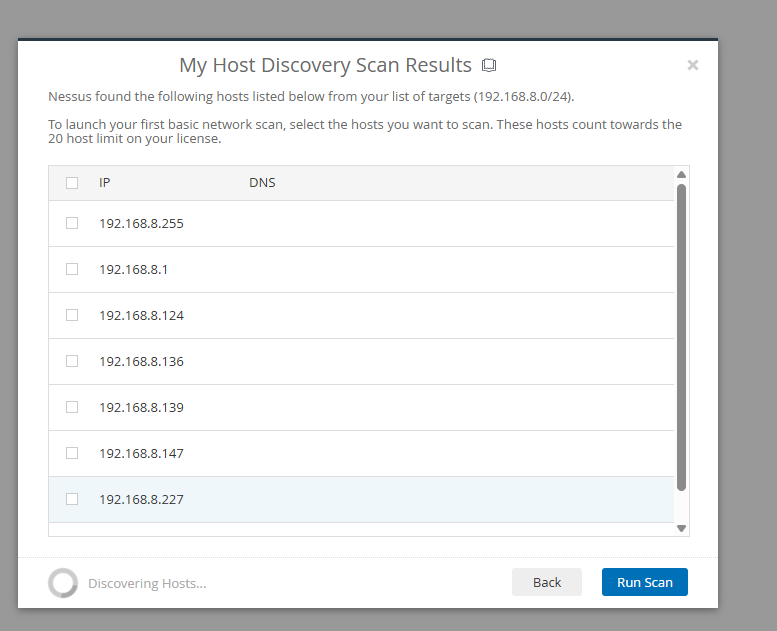

# Tenable Nessus Vulnerability Scanner Deployment on Ubuntu

## Objective
This project documents the deployment of Tenable Nessus on an Ubuntu Server virtual machine. The setup includes configuring the hypervisor environment, provisioning the Linux server, installing the Nessus daemon, and configuring the scanner via the command-line interface (CLI) and web UI.

### Skills Applied
* Virtual Machine Provisioning
* Linux Server Administration (Ubuntu, SSH, APT package management)
* Vulnerability Scanner Installation & Service Management
* Application Configuration via CLI

### Tools Used
* [VMware Workstation](https://www.vmware.com/products/workstation-pro.html)
* [Ubuntu Server ISO](https://ubuntu.com/download/server)
* [Tenable Nessus (Sign up requiered)](https://www.tenable.com/tenable-nessus-for-education)
* Secure Copy Protocol (SCP)

## Steps

### 1. Virtual Machine Provisioning
* Open VMware and click **Create a New Virtual Machine**.
* Select **Typical configuration** in the wizard and click Next.
* Choose the **Guest OS** by browsing to the Ubuntu Server image and click Next.
* Name the virtual machine `Ubuntu-Tenable`.
* Set the disk capacity to **60GB** (40GB+ recommended) and store the virtual disk as a single file, then click Next.
* Click **Customize Hardware** and allocate **8GB of RAM** and **4 processors**, then click Finish.

### 2. Ubuntu Server Configuration
* Proceed through the Ubuntu installer using default options until reaching the Profile Configuration.
* Create a username, server name, and password.
* Skip Ubuntu Pro configuration for now.
* Select the option to install the **OpenSSH server**.
* Once the installation completes, select **Reboot Now**.
* After rebooting, log in and update the system packages by running `sudo apt update && sudo apt upgrade -y`.

### 3. Tenable Nessus Installation
* Transfer the `Nessus.deb` file to the VM under the `/home/user/tmp` path using the SCP command.
* Navigate to the directory (`cd /tmp`) and unpack the installation file by running `sudo dpkg -i Nessus-*.deb`.
* Install any missing dependencies by running `sudo apt -f install -y`.
* Start the Nessus service by running `sudo systemctl start nessusd.service`.
* Verify the service is running with `sudo systemctl status nessusd.service`.
* Verify the web interface is accessible by navigating to `https://<VM's IP>:8834`.

### 4. Nessus Activation & Account Setup via CLI
* Register the Nessus instance using your activation code by running `sudo /opt/nessus/sbin/nessuscli fetch --register <Your-activation-code>`.
* Create an administrative account by running `sudo /opt/nessus/sbin/nessuscli adduser <nameoftheuser>` and follow the command prompts.
* Restart the Nessus service to apply the configuration by running `sudo systemctl restart nessusd.service` (or `bin/systemctl restart nessusd.service`).
* Go back to the web UI and hit refresh.
* Log in with the newly created account.

